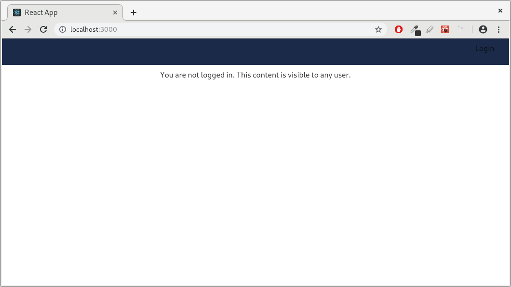
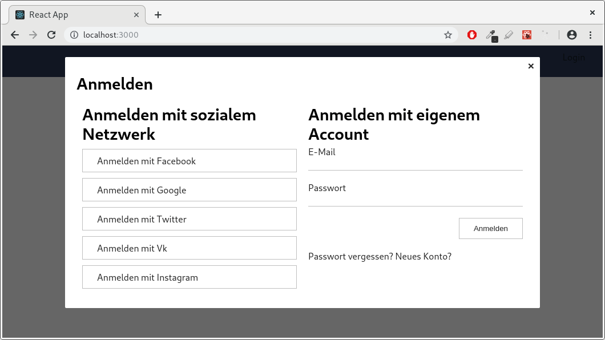
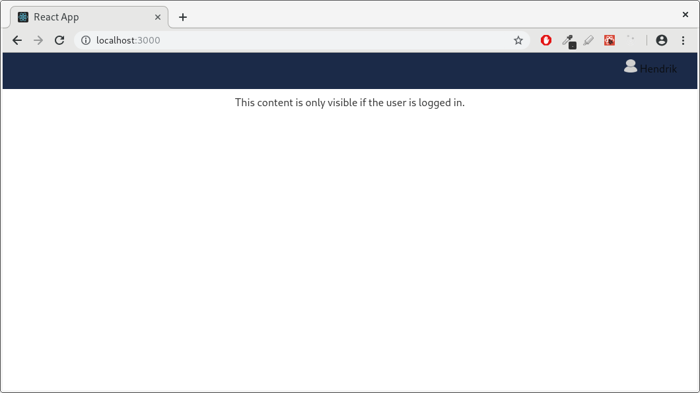

# RBMHUIM-1616 - Create a simple demo site for checking the integration docs

... and Identify which parts of the "integration flow" can be improved and what 
is missing in the documentation.

For further details see: [RBMHUIM-1616](https://jira.redbullmediahouse.com/browse/RBMHUIM-1616)

## How to run the demo app

This app has been bootstrapped using create-react-app. You just have to run `npm install` 
followed by `npm start`.
Afterwards your browser should open http://localhost:3000/ in a new tab automatically.

As you can see in the screenshots below UIM Login plugin integration with React generally 
works: 

- Adding the uim-navigation element
- Adding the usercenter element
- Load the plugin scripts
- Language initialization
- Using the UIM API
- Register callbacks in order to react to events on the UIM bus

While basic functionality can easily be achieved just by reading the documentation 
I encountered a few problems when I tried to use some advanced features or add custom 
stylings (see [Findings](#findings) below).

## Findings

### Using UIM toasts
Setting `data-uim-show-toasts` to `true` on `uim-navigation` has no effect.

### UI Styling
1) Overriding UIM styles does not work out-of-the-box by adding a custom stylesheet. 
Only hiding elements using `display: none` and changing the background color of the
dropdown menu works fine, see `styles.scss`  (I'm not sure if this is just a React problem)
2) IntelliJ won't accept the given sample stylesheet as a valid `.sass` file. 
Since the usage of semicolons and curved brackets this seems to be SCSS.
3) There's a missing curved closed bracket at the enf of the sample stylesheet.

### Trivia
#### UIM Login Plugin: 
- Hyperlink to `https://uim-design.redbull.com/static/plugin-demos/3.3/redbull/index.html` is
cut off after `../plugins-demos/`

#### Use Case: UIM Web Plugin on a voting site: 
- Hyperlink in "Step 2" leads to a 404 error page
